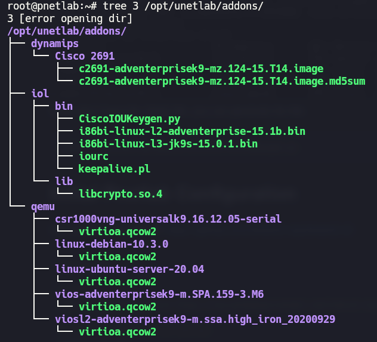

## Chapters:

- Chapter 5: Analyzing Ethernet LAN Switching
- Chapter 6: Configuring Basic Switch Managment
- Chapter 7: Configuring and Verifying Switch Interfaces
- Chapter 8: Implementing Ethernet Virtual LANs
- Chapter 9: Spanning Tree Protocol Concepts
- Chapter 10: RSTP and EtherChannel Configuration
- Chapter 11-15: IPv4 Addressing
- Chapter 16-17: IPv4 Routing

## Requirements:

**Source Repository:** Images listed below were obtained from [https://github.com/hegdepavankumar/Cisco-Images-for-GNS3-and-EVE-NG](https://github.com/hegdepavankumar/Cisco-Images-for-GNS3-and-EVE-NG).

| Image                                                              | Device Type       | Layer  | Key Information                                                |
|:-------------------------------------------------------------------|:------------------|:-------|:---------------------------------------------------------------|
| `i86bi-linux-l2-adventerprise-15.1b.zip`                           | IOU L2 Switch     |  L2    | Basic Layer 2 IOU switch.                                      |
| `cat9kv-17.10.01-prd7.tgz` (Cisco Catalyst 9000v)                  | Cat9k Switch      |  L2/3  | Modern IOS XE switch, supports L2/L3. Higher resource usage.   |
| `i86bi-linux-l3-jk9s-15.0.1.bin`                                   | IOU L3 Router     |  L3    | Basic Layer 3 IOU router.                                      |
| `csr1000vng-universalk9.17.03.05-serial.tgz` (Cisco CSR1000v 17.x) | CSR1000v Router   |  L3    | Modern IOS XE router, also for SD-WAN. Higher resource usage.  |
| `c2691-adventerprisek9-mz.124-15.T14.image`                        | Cisco 2691 Router |  L3    | Classic Dynamips router, simpler scenarios.                    |
| `c3725-adventerprisek9-mz.124-15.T14.image`                        | Cisco 3725 Router |  L3    | Classic Dynamips router, more capable than c2691.              |
| `c7200-adventerprisek9-mz.153-3.XB12.image`                        | Cisco 7200 Router |  L3    | High-performance Dynamips router.                              |
| `c8000v-17.06.03.tgz` (Cisco Catalyst 8000V Edge)                  | C8000v Router     |  L3    | Modern IOS XE router for SD-WAN. Higher resource usage.        |
| `linux-centos-8.tgz`                                               | Linux Node        |  N/A   | CentOS 8 based Linux node for simulating hosts/servers/tools.  |
| `linux-debian-10.3.0.tgz`                                          | Linux Node        |  N/A   | Debian 10 based Linux node for simulating hosts/servers/tools. |
| `linux-ubuntu-21.04-desktop.tgz`                                   | Linux Node        |  N/A   | Ubuntu Desktop 21.04 based Linux node, higher resource usage.  |

**Official image and platform requirements:** [https://developer.cisco.com/docs/modeling-labs/faq/#reference-platform-and-images-questions](https://developer.cisco.com/docs/modeling-labs/faq/#reference-platform-and-images-questions)

## Initial EVE-NG Configuration

These are some initial commands that might be useful for setting up your EVE-NG environment.

```bash
# Update package lists
sudo apt update

# Fix permissions issues within the EVE-NG lab directory
sudo /opt/unetlab/wrappers/unl_wrapper -a fixpermissions

# Transfer files from your host machine to the virtual machine (VM) where EVE-NG is installed
scp some-file.zip root@192.168.1.100:/root/
```

## Image Placement in EVE-NG

Place the downloaded image files in the following directories within your EVE-NG VM:

* **.image and .image.md5sum files (for Dynamips-based routers):** `/opt/unetlab/addons/dynamips/`
* **.bin files (for IOU - IOS on Linux):** `/opt/unetlab/addons/iol/bin/`
* **.qcow2 files (for Qemu-based VMs like Linux nodes and modern Cisco devices):** `/opt/unetlab/addons/quemu/<respective_file_name>/` (create the subdirectory if it doesn't exist)

> [!IMPORTANT]
> After adding new images, you might need to fix permissions again.



If you don't have the `iourc` file, you can generate like this:

```sh
python2 /opt/unetlab/addons/iol/bin/CiscoIOUKeygen.py
```

## Initial Pnetlab Configuration

Use ishare2 from this url: https://github.com/ishare2-org/ishare2-cli
```sh 
apt update

# Install ishare2
wget -O /usr/sbin/ishare2 https://raw.githubusercontent.com/ishare2-org/ishare2-cli/main/ishare2 && chmod +x /usr/sbin/ishare2 && ishare2

# try upgrade ishare2 and pnetlab.
ishare2 upgrade
```

## How to Execute Python Scripts

These steps outline how to set up a virtual environment and run Python scripts (like those using Netmiko) on a Linux node within EVE-NG.

```bash
# Create a virtual environment named 'venv'
python3 -m venv venv

# Activate the virtual environment
source venv/bin/activate.fish

# Install the Netmiko library
pip install netmiko

# Run your Python script
python -m chapter-6.01

# Deactivate the virtual environment when you're done
deactivate
```
