# RSTP and EtherChannel Configuration

This chapter covers the following topics:

- Configure and verify (Layer 2/Layer 3) EtherChannel (LACP)
- Interpret basic operations of Rapid PVST+ Spanning Tree Protocol
    - Root port, root bridge (primary/secondary), and other port names
    - Port states and roles
    - PortFast
    - Root guard, loop guard, BPDU filter, and BPDU guard

## Lab: Advanced RSTP Design and EtherChannel Implementation

### 1. Topology Overview

This lab simulates a redundant campus network with a three-switch distribution triangle to demonstrate complex STP convergence.

- **Distribution Layer (Core):** Three switches (`DSW1`, `DSW2`, `DSW3`) interconnected in a full mesh loop.
- **Access Layer:**
    - **ASW1:** Production switch (End users & Servers).
    - **ASW2:** Lab/Testing switch (High risk of rogue devices).
- **VLANs:** 10 (Native), 20 (User_Data), 30 (Server_Farm).

### 2. Base Configuration & Layer 2 Setup

Basic settings & VLAN creation apply to all switches (`DSW1`, `DSW2`, `DSW3`, `ASW1`, `ASW2`).

```bash
SW> enable
SW# configure terminal
SW(config)# hostname <hostname>

SW(config)# line console 0
SW(config-line)# logging synchronous
SW(config-line)# exec-timeout 20 0
SW(config-line)# exit

SW(config)# no ip domain lookup
SW(config)# vtp mode off

SW(config)# vlan 10
SW(config-vlan)# name NATIVE
SW(config-vlan)# exit
SW(config)# vlan 20
SW(config-vlan)# name USER_DATA
SW(config-vlan)# exit
SW(config)# vlan 30
SW(config-vlan)# name SERVER_FARM
SW(config-vlan)# exit

SW# show vlan brief
```

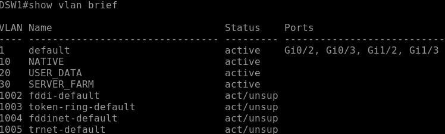

### 3. Spanning Tree Protocol (RSTP) config

#### 3.1. Enable Rapid-PVST+

Apply to ALL Switches

```bash
SW(config)# spanning-tree mode rapid-pvst
```

#### 3.2. Root Bridge Selection

- **DSW1:** Primary Root for critical VLANs (10, 20).
- **DSW2:** Secondary Root (Backup).
- **DSW3:** Non-Root Distribution (Default priority).

```bash
# On DSW1 (Primary)
DSW1(config)# spanning-tree vlan 10,20 root primary
# You can set priority value manually
DSW1(config)# spanning-tree vlan 30 priority 4096
```

```bash
# On DSW2 (Secondary)
DSW2(config)# spanning-tree vlan 10,20 root secondary
DSW2(config)# spanning-tree vlan 30 priority 8192
```

```bash
# On DSW2 (Non-Root)
DSW3(config)# spanning-tree vlan 10,20,30 priority 32768
```

```bash
# Check the root switch (DSW1 should be the root bridge)
DSW1# show spanning-tree bridge
DSW1# show spanning-tree root
DSW1# show spanning-tree vlan <vlan_id>
```

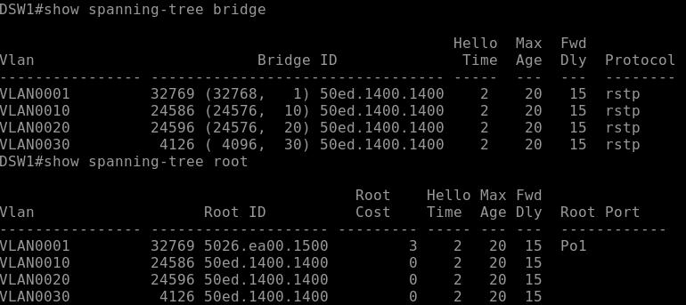

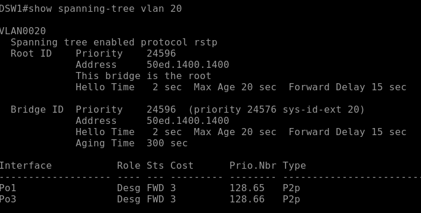

#### 3.3. Path Manipulation (Cost)

The direct fiber link from `ASW1` to `DSW1` (g1/0) is degrading. Force VLAN 20 traffic via `DSW2`.

```bash
# On ASW1
ASW1(config)# int g1/0
ASW1(config-if)# description UPLINK_TO_DSW1
ASW1(config-if)# spanning-tree vlan 20 cost 20000
```

### 4. EtherChannel Implementation

Objective: Implement Manual, LACP, and PAgP EtherChannels to interconnect all switches.

#### 4.1. DSW1 to DSW2 (Static - Po1)

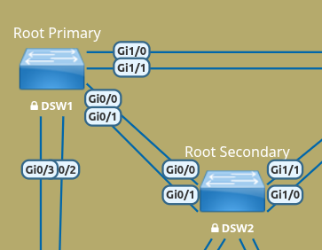

```bash
# On DSW1 and DSW2
DSW1(config)# default interface range g0/0-1
DSW1(config)# int range g0/0-1

DSW1(config-if-range)# description CORE_TRUNK_DSW1_DSW2
DSW1(config-if-range)# switchport trunk encapsulation dot1q
DSW1(config-if-range)# switchport mode trunk
DSW1(config-if-range)# switchport trunk native vlan 10
DSW1(config-if-range)# switchport nonegotiate
DSW1(config-if-range)# no shutdown
DSW1(config-if-range)# channel-group 1 mode on
DSW1(config-if-range)# exit

DSW1# show etherchannel port-channel 1
```

#### 4.2. DSW2 to DSW3 (LACP - Po2)

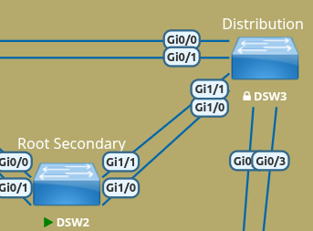

```bash
# On DSW2 and DSW3
DSW2(config)# default interface range g1/0-1
DSW2(config)# int range g1/0-1
DSW2(config-if-range)# description CORE_TRUNK_DSW2_DSW3
DSW2(config-if-range)# switchport trunk encapsulation dot1q
DSW2(config-if-range)# switchport mode trunk
DSW2(config-if-range)# switchport trunk native vlan 10
DSW2(config-if-range)# switchport nonegotiate
DSW2(config-if-range)# no shutdown
DSW2(config-if-range)# channel-group 2 mode active

# for DSW3 you can use passive
DSW3(config-if-range)# channel-group 2 mode passive
```

#### 4.3. DSW3 to DSW1 (LACP - Po3)

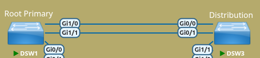

```bash
# On DSW3
DSW3(config)# default interface range g0/0-1
DSW3(config)# int range g0/0-1
DSW3(config-if-range)# description CORE_TRUNK_DSW3_DSW1
DSW3(config-if-range)# switchport trunk encapsulation dot1q
DSW3(config-if-range)# switchport mode trunk
DSW3(config-if-range)# switchport trunk native vlan 10
DSW3(config-if-range)# switchport nonegotiate
DSW3(config-if-range)# no shutdown
DSW3(config-if-range)# channel-group 3 mode active

# On DSW1
DSW1(config)# default interface range g1/0-1
DSW1(config)# int range g1/0-1
DSW1(config-if-range)# description CORE_TRUNK_DSW1_DSW3
DSW1(config-if-range)# switchport trunk encapsulation dot1q
...
```

#### 4.4. Check the config

```bash
DSW1# show interfaces port-channel 1
DSW1# show etherchannel
DSW1# show etherchannel summary
DSW1# show etherchannel summary | begin Group
DSW1# show running-config

# if you need to enter to etherchannel config, try this
DSW1(config)# interface port-channel 1
DSW1(config-if)# <do_something>
```

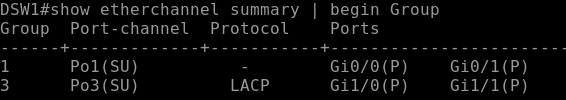
<br>
<br>
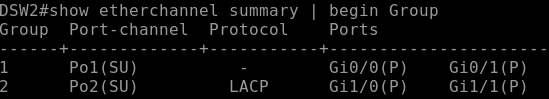
<br>
<br>
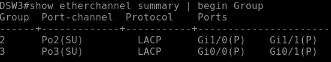

#### 4.5. ASW1 Uplinks (LACP - Po10)

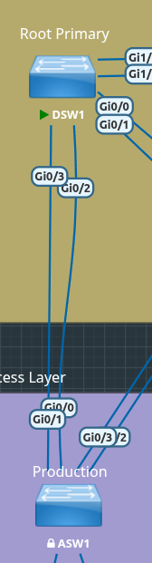

```bash
# On ASW1
ASW1(config)# int range g0/0-1
ASW1(config-if-range)# description UPLINK_ASW1_DSW1
ASW1(config-if-range)# switchport trunk encapsulation dot1q
...
ASW1(config-if-range)# channel-group 10 mode active

# On DSW1
DSW1(config)# int range g0/2-3
DSW1(config-if-range)# description UPLINK_DSW1_ASW1
DSW1(config-if-range)# switchport trunk encapsulation dot1q
...
DSW1(config-if-range)# channel-group 10 mode active
```

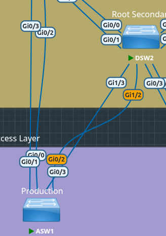

```bash
# On ASW1
ASW1(config)# int range g0/2-3
ASW1(config-if-range)# description UPLINK_ASW1_DSW2
ASW1(config-if-range)# switchport trunk encapsulation dot1q
...
ASW1(config-if-range)# channel-group 11 mode active

# On DSW2
DSW2(config)# int range g1/2-3
DSW2(config-if-range)# description UPLINK_DSW2_ASW1
DSW2(config-if-range)# switchport trunk encapsulation dot1q
...
DSW2(config-if-range)# channel-group 11 mode active

```

#### 4.6. ASW2 Uplinks (PAgP Desirable/Auto - Po20)

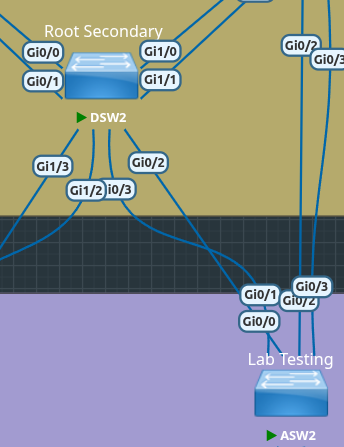

```bash
# On ASW2
ASW2(config)# int range g1/0-1
ASW2(config)# description UPLINK_ASW2_DSW2
ASW2(config)# switchport trunk encapsulation dot1q
...
ASW2(config)# channel-group 20 mode desirable

# On DSW2
DSW2(config)# int range g0/2-3
DSW2(config)# description UPLINK_DSW2_ASW2
DSW2(config)# switchport trunk encapsulation dot1q
...
DSW2(config)# channel-group 20 mode auto
```

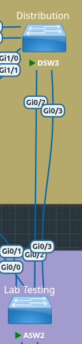

```bash
# On ASW2
ASW2(config)# int range g0/2-3
ASW2(config)# description UPLINK_ASW2_DSW3
ASW2(config)# switchport trunk encapsulation dot1q
...
ASW2(config)# channel-group 21 mode desirable

# On DSW3
DSW2(config)# int range g0/2-3
DSW2(config)# description UPLINK_DSW2_ASW2
DSW2(config)# switchport trunk encapsulation dot1q
...
DSW2(config)# channel-group 21 mode auto
```

### 5. Security & Hardening
