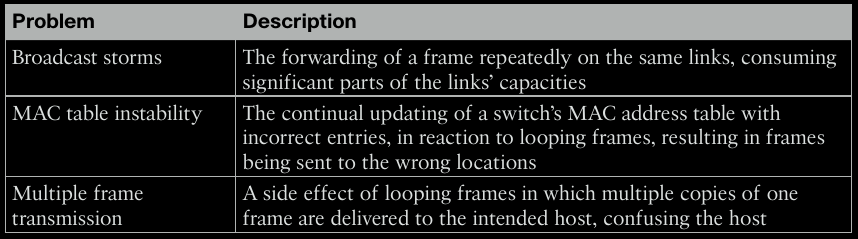
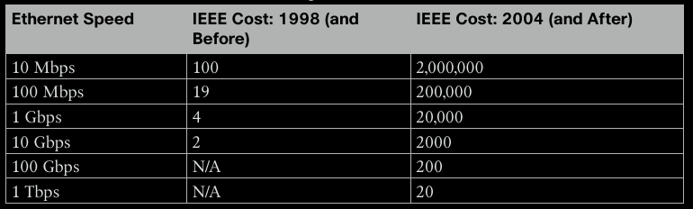
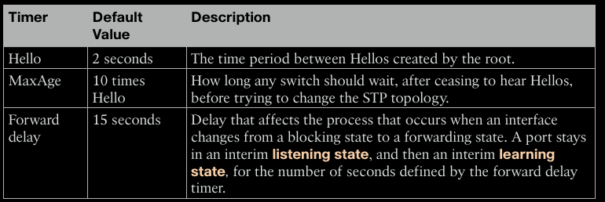
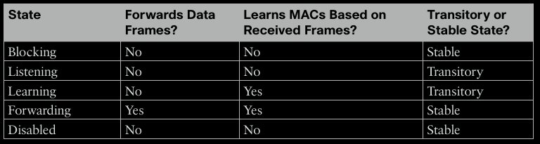
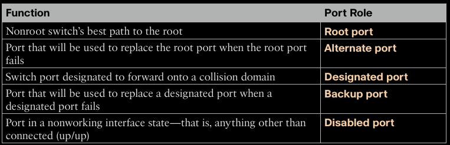
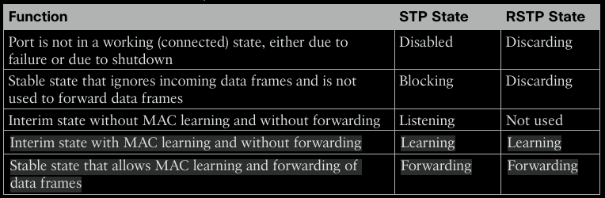

# Spanning Tree Protocol Concepts

This chapter covers the following topics:

- [The Need for Spanning Tree (STP)](#the-need-for-spanning-tree-stp)
- [How STP Works: The 3-Step Election](#how-stp-works-the-3-step-election)
- [STP Timers and States (Classic 802.1D)](#stp-timers-and-states-classic-8021d)
- [Rapid STP (RSTP - 802.1w)](#rapid-stp-rstp-8021w)

## The Need for Spanning Tree (STP)

Redundant switch links create Layer 2 loops, which cause three main problems:

- **Broadcast Storms:** A single broadcast frame is looped and replicated indefinitely, consuming all available bandwidth.
- **MAC Table Instability:** Switches continuously re-learn the same source MAC address on different ports, causing instability.
- **Multiple Frame Transmission:** A destination host receives multiple copies of the same unicast frame.

STP's primary goal is to **prevent these loops** by logically blocking redundant paths, creating a single, loop-free "tree" topology.

## How STP Works: The 3-Step Election

STP decides which ports to block by electing one **Root Switch** and then calculating the best path from all other switches to it. This happens in three steps.

- **Step 1:** Elect the Root Switch (Root Bridge)
    - **Goal:** To select a single switch as the reference point for the entire network.
    - **Process:** Switches exchange `BPDU` (Bridge Protocol Data Unit) messages. Each switch has a unique `Bridge ID (BID)`.
    - **BID Format:** The `BID` is an 8-byte value:
        - 2-byte **Priority** (Default: 32768)
        - 6-byte **MAC Address**
    - **Winner:** The switch with the numerically lowest BID becomes the `Root Switch`.
        - The switch with the **lowest Priority** wins.
        - If Priorities are tied, the switch with the **lowest MAC Address** wins.
    - **Result:** All working ports on the `Root Switch` are placed in the **forwarding state**. They are all `Designated Ports (DP)`.

- **Step 2:** Elect Root Ports (RP) on Non-Root Switches
    - **Goal:** For every non-root switch, find the one port that has the best path to the Root Switch.
    - **Process:** Switches calculate the `Root Cost`, which is the total cumulative cost to reach the Root Switch. Each link has a cost. A switch calculates its Root Cost by taking the `Sender's Root Cost` (from a received Hello BPDU) and adding its own `Interface Cost` for the port that received it.
    - **Winner:** The port with the lowest Root Cost becomes the `Root Port (RP)`.
    - **Result:** The `Root Port` is placed in the **forwarding state**.
    - **Tie-Breakers (if costs are equal):**
        - Lowest neighbor **BID**.
        - Lowest neighbor **Port Priority**.
        - Lowest neighbor **internal Port Number**.

- **Step 3:** Elect Designated Ports (DP) on Each Segment
    - **Goal:** On every network segment, determine which switch is "in charge" of forwarding traffic onto that segment.
    - **Process:** On a link between two switches, both switches compare the `Root Cost` they advertise.
    - **Winner:** The switch advertising the **lowest Root Cost** becomes the `Designated Switch` for that segment. Its port on that segment becomes the `Designated Port (DP)`.
        - If Root Costs tie, the switch with the **lowest BID** wins.
    - **Result:** The `Designated Port` is placed in the **forwarding state**.

**Final Result:** Any port that is not a `Root Port` or a `Designated Port` is put in the **blocking state**. This breaks all loops.

## STP Timers and States (Classic 802.1D)

Classic STP is slow because it relies on timers.

When a blocked port needs to become a forwarding port (e.g., after the main `Root Port` fails), it must go through two transitory states. This prevents temporary loops.

Total STP Convergence Time: `MaxAge` (20s) + `Listening` (15s) + `Learning` (15s) = ~50 seconds.

## Rapid STP (RSTP - 802.1w)

RSTP's main goal is to **drastically reduce convergence time** (from 50s to <10s or even sub-second).

- **RSTP vs. STP: Similarities**
    - Root Switch election is **identical**.
    - Root Port election is **identical**.
    - Designated Port election is **identical**.

- **RSTP vs. STP: Key Differences**

- **Faster Convergence:** If the `Root Port` fails, the pre-selected `Alternate Port` immediately transitions to `Forwarding`, skipping all timers.

- **New States:** RSTP combines/renames states to simplify the process. The `Listening` state is eliminated. `Blocking` is renamed `Discarding`.

- **Port Types:**
    - **Point-to-Point:** Links to other switches (full-duplex). Can converge rapidly.
    - **Edge Port:** Links to end devices (PCs, servers). This is the standard name for Cisco's **PortFast**. It goes to **Forwarding** immediately.
    - **Shared:** Links to hubs (half-duplex). Uses slower, timer-based convergence.
- **STP Costs**: The "cost" of a link determines the best path. Lower is better. Cisco switches traditionally use the "short" (1998) method.
- **Optional STP Features (Optimization & Security)**
    - **EtherChannel:** Bundles 2-8 physical links into one logical link. STP treats this bundle as a **single port**, which prevents STP from blocking redundant links and allows for load balancing.
    - **PortFast:** (Cisco feature) For ports connected only to end devices. This command makes the port skip the `Listening` and `Learning` states (30-second delay) and go immediately to Forwarding. **Never use on a port connected to another switch**.
- **BPDU Guard: (Security)** Used with `PortFast`. If a port with BPDU Guard enabled ever receives a BPDU, it is immediately put into an `err-disabled state`. This prevents loops if a rogue switch is connected.
- **BPDU Filter:**
    - **Global Mode:** A PortFast port sends a few BPDUs, then stops. If it receives a BPDU, it **disables PortFast** and becomes a normal STP port (slower, but safer than BPDU Guard).
    - **Interface Mode:** Disables STP on the port. No BPDUs are sent or received. Dangerous. Used to connect separate STP domains.
- **Root Guard: (Security)** Enabled on ports that should never lead to the Root Switch (e.g., ports facing an untrusted network). If a `superior BPDU` (from a switch trying to become root) arrives on this port, Root Guard puts the port in a `broken state`.
- **Loop Guard: (Protection)** Enabled on `Root Ports` and `Alternate Ports`. These ports expect to receive BPDUs. If BPDUs suddenly stop (due to a unidirectional link failure), Loop Guard puts the port in a `broken state` to prevent it from incorrectly becoming a `Designated Port` and causing a loop.
